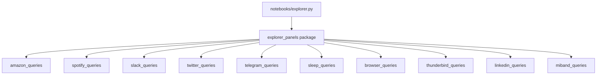

# Dashboard depth assessment — September 2026

## Executive summary

The combined Marimo explorer ([`notebooks/explorer.py`](../notebooks/explorer.py)) exposes **10 source tabs**. Depth varies sharply: Amazon, Spotify, and Slack sit at a Wrapped-grade ceiling; Mi Band, LinkedIn, and Thunderbird lag the shared checklist of period-compare, streaks, circadian+calendar, forgotten/comeback arcs, bump/rank or scatter, and narrative or entity drilldown.

**Three weakest (priority order at assessment time):**

1. **Mi Band** (2.0/10) — six HR queries, four thin panel sections, year-only filters  
2. **LinkedIn** (3.5/10) — eleven descriptive queries; unused ingest tables; raw career/follows tables  
3. **Thunderbird** (5.0/10) — solid volume/filters but no arcs, bump, streaks, or contact drilldown  

Browser (5.5) is next-weakest and out of scope for this upgrade pass.

**Status:** upgrades for the three weakest landed in the same change set (see Upgrade backlog). Re-score after upgrade: Mi Band ~6, LinkedIn ~7, Thunderbird ~7.

---

## Rubric

| Dimension | Weight | Measure |
|-----------|--------|---------|
| Query breadth | 25% | Analytical functions in `*_queries.py` (excludes helpers / `data_bounds` / `filter_*`) |
| Panel surface | 20% | `###` sections, panel LOC, chart-type diversity |
| Chart richness | 15% | Plotly call volume + variety |
| Peer Wrapped checklist | 40% | Period-compare, streaks, circadian+calendar, forgotten/comeback, bump/rank, scatter/index, narrative or person/entity drilldown |

**Benchmark pattern** (Spotify / Telegram / Twitter / Slack): scoreboard with compare, streaks, circadian + calendar, forgotten + comeback, bump or scatter, and narrative and/or entity lock.

---

## Scorecard

| Rank | Dashboard | Queries (approx.) | Panel sections | Query LOC | Depth /10 | Notes |
|------|-----------|------------------:|---------------:|----------:|----------:|-------|
| 1 | Amazon | 43 | 16 | 1062 | **9.5** | Multi-surface commerce observatory |
| 1 | Spotify | 37 | 12 | 1411 | **9.5** | Pattern-completeness champion |
| 3 | Slack | 36 | 9+spotlight | 1274 | **9.0** | Person drilldown champion |
| 4 | Twitter | 25 | 11 | 897 | **8.0** | Full Wrapped + narrative |
| 4 | Telegram | 23 | 10 | 914 | **8.0** | Relationships + text NLP |
| 6 | Sleep | 22 | 11 | 701 | **7.5** | Cross-source overlays |
| 7 | Browser | 18 | 11 | 636 | **5.5** | Arcs + narrative; weak circadian/streaks |
| 8 | **Thunderbird** | 15 | 8 | 522 | **5.0** | Volume/top-N; missing arcs |
| 9 | **LinkedIn** | 11 | 5 | 324 | **3.5** | Descriptive only; unused tables |
| 10 | **Mi Band** | 6 | 4 | 186 | **2.0** | Vital-signs strip |

Entrypoints: panel builders in [`src/data_dumps/explorer_panels/`](../src/data_dumps/explorer_panels/); queries in `src/data_dumps/{source}_queries.py`.

---

## Peer checklist matrix

| Pattern | Spotify | Amazon | Slack | Thunderbird | LinkedIn | Mi Band |
|---------|---------|--------|-------|-------------|----------|---------|
| Period-compare scoreboard | yes | no | yes | yes | no | no |
| Streaks | yes | no | yes | no | no | no |
| Circadian + calendar | yes | yes | yes | yes | yes | circadian only |
| Forgotten + comeback | yes | yes | yes | **no** | **no** | **no** |
| Bump / rank movement | yes | no | yes | **no** | **no** | **no** |
| Scatter / derived index | yes | impulse/cart | reply ratio | **no** | **no** | raw extremes |
| Narrative / entity drilldown | narrative | multi-surface | person_* | **no** | **no** | **no** |

---

## Per-dashboard notes

### Amazon (9.5) — breadth champion
Spend scoreboard, life chapters, search funnel, cart vs ordered, impulse index, returns, forgotten/repurchased ASINs, plus conditional Alexa / Audible / Video / Kindle / Music / impressions / Rufus. Gap: no streaks, bump, or LLM narrative.

### Spotify (9.5) — pattern completeness
Click-to-filter artists, scoreboard+streaks+milestones, rank movement, discovery/shuffle/circadian, album depth, forgotten/comebacks, expanded encodings, MusicBrainz + Account Data, LLM narrative.

### Slack (9.0) — drilldown champion
Workspace Wrapped plus person spotlight (share vs team, dual heatmaps, collaborators, emoji, text profile, streaks). No LLM narrate.

### Twitter (8.0) / Telegram (8.0)
Full communication Wrapped. Telegram adds text NLP and reply Sankey; Twitter adds DMs and network snapshot.

### Sleep (7.5)
Regularity KPIs, actigraphy, alarms, Mi Band HR overlay, late-night Spotify × sleep. No forgotten/bump/narrative (less applicable).

### Browser (5.5)
Domain lock, forgotten gems, routines, comebacks, path tree, narration. Missing circadian (last-seen grain), streaks, bump, scatter.

### Thunderbird (5.0)
Strong filters (account/folder/direction/signal/contact) and period-compare already. Analysis stops at volume, top-N people/domains, folder mixes, thread table, attachment/signal pie. Missing forgotten/comeback contacts, sender bump, streaks, thread latency, scatter, narrative, contact lock UI.

### LinkedIn (3.5)
Year sliders only. Scoreboard + connection tops + raw career table + me/them messages + circadian/calendar on messages + activity stack + follows list. Ingest already has invitations, endorsements, events, learning, member_follows, skills — unused in explorer.

### Mi Band (2.0)
Only `miband.heart_rate`. Scoreboard, daily line, hour bars, weekday×hour heatmap, zone pie, raw extremes table. No monthly series, calendar, period-compare, resting baseline, streaks/anomalies, or sleep join in this panel (Sleep consumes Mi Band instead).

---

## Weakest-three deep dive

### 1. Mi Band
**Data constraint:** one-off Mi Fit HR CSV — deepen within that grain; no steps/sleep from this source.

**Upgrade target (~6/10):** compare scoreboard, monthly longitudinal, calendar, resting HR (night hours), zone monthly trends, high-HR day streaks / anomalous days vs rolling baseline, optional sleep overlay when `sleep.sessions` exists.

### 2. LinkedIn
**Data opportunity:** many unused GDPR tables.

**Upgrade target (~7/10):** compare + streaks; forgotten/comeback conversations; conversation scatter; monthly + bump; career timeline chart; gated invitations/endorsements/events/learning; click-lock conversation.

### 3. Thunderbird
**Upgrade target (~7/10):** forgotten/comeback contacts; sender rank bump; message streaks; thread latency/depth; contact scatter; contact lock from search/table; aggregate-only narrative.

---

## Upgrade backlog (this pass) — done

| Priority | Source | Primary files | Status |
|----------|--------|---------------|--------|
| P0 | Mi Band | `miband_queries.py`, `explorer_panels/miband.py`, `tests/test_miband_queries.py`, `test_explorer_panels.py` | shipped |
| P1 | LinkedIn | `linkedin_queries.py`, `explorer_panels/linkedin.py`, tests | shipped |
| P2 | Thunderbird | `thunderbird_queries.py`, `explorer_panels/thunderbird.py`, `llm_client.py`, tests | shipped |

**Out of scope:** Browser upgrades; **any further Mi Band work** (frozen one-off; see ROADMAP Non-goals); matching Amazon multi-surface breadth; new dependencies.

---

## Architecture reference

