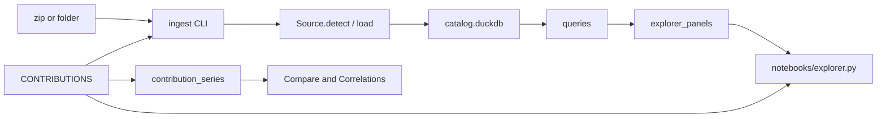

# Project stocktake — 23 September 2026

Reviewed on `main` at `52a7893`, even with `origin/main`. Package version **0.2.1** (MIT). One author, **51 commits** from 2 September 2026 (`first commit`) through 23 September 2026.

`uv sync --extra dev` then `uv run pytest`: **382 passed** in 16s on Python 3.11.16. The package requires 3.11 (`datetime.UTC`).

This note is a current-state review. The September depth scorecard ([dashboard-depth-2026-09.md](dashboard-depth-2026-09.md)) describes an earlier explorer (10 source tabs, pre-upgrade Mi Band / LinkedIn / Thunderbird). Those three upgrades landed. Many sources in the table below did not exist when that scorecard was written.

## Where the project is

`data_dumps` is a local ingest-and-explore tool for one person's GDPR and app exports. Exports and `catalog.duckdb` stay under `~/Documents/data_dumps_raw` (or `DATA_DUMPS_ROOT`), outside git. The product shape is settled:

- One DuckDB file, single-writer.
- One combined Marimo explorer (`notebooks/explorer.py`), plus a few thin standalone notebooks.
- One explicit `Contribution` per dump in [`src/data_dumps/contributions.py`](../src/data_dumps/contributions.py). No plugin scan.
- A hard privacy boundary: source tables do not carry emails, IPs, phones, ads, or KYC. The Tools tab indexes emails and login/access-log IPs beside the warehouse, in JSON caches that are not committed.

Three weeks of work took it from a Spotify Wave 1 loader to **20 contributions** (19 explorer tabs plus Spotify Account Data, which has no tab of its own), cross-source Compare and Correlations, a Tools index, a custom-manifest escape hatch, Docker, CI, and a public landing page. Wave 2 (shared filters, richer charts, MusicBrainz, local aggregate-only narratives) is in the tree for the sources that use it.

The pressure now is keeping the docs and the notebook wiring as honest as the loaders. New dumps still work, and the add-a-dump checklist is the right gate. The explorer notebook still hand-lists every tab.

## Size

| Tree | Python lines | Notes |
|------|-------------:|-------|
| `src/data_dumps` | 51,018 | 132 modules |
| `sources/` | 15,783 | loaders |
| query modules | 18,491 | per-source queries, the five packages below, Compare, Correlations, overview, `query_util` |
| `explorer_panels/` | 9,074 | |
| `contribution_series/` | 3,643 | Compare + Correlations descriptors |
| `tests/` | 11,002 | 53 files, 382 collected tests |
| `notebooks/` | 1,819 | `explorer.py` is 1,436 of that |
| `docs/` | 1,645 | Markdown |

Query packages (split so a new dump does not grow one file): `spotify_queries`, `slack_queries`, `amazon_queries`, `google_queries`, `chatgpt_queries`. Contract test: `tests/test_query_packages.py`.

Runtime dependencies: DuckDB, Marimo, Plotly, pandas, pytz, requests, openpyxl, tldextract, wordcloud, maxminddb. Optional extra `llm` is LiteLLM. Dev extra is pytest, ruff, black, mypy.

CLIs: `ingest`, `email-inventory`, `ip-inventory`, `enrich-musicbrainz`.

## Explorer surface

Tabs appear only when their gate table exists. Cross-cutting tabs are always in the notebook:

| Tab | Role |
|-----|------|
| Home | Warehouse totals, year span, per-source row counts |
| Compare | Monthly overlay, each series as **% of its own max**; Pearson on aligned shapes |
| Correlations | Daily-first Pearson matrix, presets (Life rhythm / Comms / Sleep & body), focus scatter, ±7 day lag |
| Tools | Email index and IP index (city/ISP when GeoLite2 MMDB files are present) |

Built-in source tabs, in detect order. Query and panel figures are Python lines, including filters and helpers. They measure weight, not chart quality.

| Tab | Gate | Queries | Panel | What the panel is |
|-----|------|--------:|------:|-------------------|
| Spotify | `spotify.plays` | 1,644 | 684 | Wrapped ceiling: scoreboard, streaks, rank movement, discovery/shuffle/circadian, album depth, forgotten/comebacks, country map, Account Data library, MusicBrainz, narrative |
| Telegram | `telegram.messages` | 953 | 474 | Chat Wrapped, text/emoji, reply Sankey, narrative on aggregates |
| LinkedIn | `linkedin.connections` | 833 | 354 | Network, career map, message lock, forgotten/comebacks, gated invitations/endorsements/events/learning |
| Twitter | `twitter.tweets` | 882 | 511 | Wrapped, DMs, network snapshot, narrative. Classic `window.YTD` JS only |
| Slack | `slack.messages` | 1,372 | 566 | Workspace Wrapped plus person spotlight |
| Sleep | `sleep.sessions` | 690 | 415 | Regularity, circadian, calendar, actigraphy, alarms, Mi Band overlay, late Spotify × sleep |
| Mi Band | `miband.heart_rate` | 484 | 213 | HR strip: compare, resting, zones, anomalies. **Frozen** — do not extend |
| Browser | `browser.pages` | 611 | 323 | URL-grain history, forgotten/routines/comebacks, path tree, narrative. Visit-level circadian still deferred |
| Thunderbird | `thunderbird.messages` | 782 | 392 | Volume, contact lock, arcs, threads, signals, narrative. Metadata only; no bodies in the warehouse |
| Ring | `ring.device_events` | 554 | 201 | Devices, city map, online/offline stretches, motion, app spikes, billing |
| Amazon | `amazon.order_items` | 1,384 | 684 | Commerce observatory: spend, search funnel, returns, conditional Alexa / Audible / Video / Kindle / Music / Rufus |
| Duolingo | `duolingo.progress_events` | 398 | 201 | Light: scoreboard, XP, leagues, progress calendar, inventory |
| Uber | `uber.trips` | 670 | 291 | Trips and Eats, city maps from a gazetteer (GPS scrubbed), forgotten cities, fare × distance |
| Google | `google.calendar_events` | 1,567 | 615 | Calendar, photos metadata, Maps saves, Play, My Activity titles, tasks, footprint |
| Airbnb | `airbnb.reservations` | 674 | 292 | Stays, search-pin map, VAT-country choropleth, place bump, wishlists |
| ChatGPT | `chatgpt.messages` | 1,554 | 534 | Model bump, conversation lock, word clouds, latency, projects/GPTs, narrative |
| Cursor | `cursor_history.messages` | 1,037 | 385 | Sessions, tools, transcript lock, forgotten/comebacks, narrative |
| Ollama | `ollama.messages` | 1,108 | 333 | Chats, models, thinking, tools, transcript lock, word clouds, narrative |
| Custom | `custom.events` | 368 | 178 | Manifest CSV/JSON/JSONL: scoreboard, entities, forgotten/comebacks, rhythm |

Spotify Account Data is a second loader (`spotify_account`) with no tab. It fills library, playlist, and search tables on the Spotify panel.

Narrate-this-view (aggregates only, off unless `DATA_DUMPS_LLM_ENABLED=1`, Ollama on loopback by default): Spotify, Telegram, Twitter, Thunderbird, Browser, ChatGPT, Cursor, Ollama.

Wall-clock zones are hardcoded: `Europe/Rome` for most sources, `Europe/Paris` for Slack, Google, Airbnb, ChatGPT, Cursor, and Ollama, `Europe/London` for Ring.

## How a dump is wired

`Source` is a small protocol: `detect`, `load`, `tables`, `inventory`. Detect order is the order of `CONTRIBUTIONS`. Custom is last, so a `data_dumps.json` sitting next to a real export does not steal the path.

A second extension path is a single file, `$DATA_DUMPS_ROOT/user_contributions.py`, imported by path. It can append loaders and panels. It is not a directory scan and not a setuptools entry point.

Loaders create on the order of 140 tables. Amazon's schema module alone has 28 `CREATE TABLE` statements; LinkedIn has 21. MusicBrainz adds match tables beside `spotify`.

Standalone notebooks that call the same panel builders: `spotify.py`, `telegram.py`, `linkedin.py`, `twitter.py`, `sleep.py`, `amazon.py`. Everything else is explorer-only.

## Privacy boundary

Enforced in loaders and checked by synthetic ingest tests (no real dump in git):

- Emails stay off source tables. Tools rebuilds `warehouse/email_inventory.json` from account fields the dashboards skip, other people's profiles, and in-text mentions. Thunderbird bodies are read from the local profile when it is mounted, and are not stored.
- IPs stay off source tables. Tools rebuilds `warehouse/ip_inventory.json` from login, session, device, and access-log files. GeoLite2 City and ASN databases are optional, local, and not committed. Private and documentation ranges are listed and left off the map.
- Phones, ads, and KYC are dropped at ingest.
- LLM prompts are pre-aggregated KPIs and top-N lists. `tests/test_llm_privacy.py` guards that.
- Cursor History redacts common API-key shapes in warehouse text. Raw export files are left unchanged.
- The dashboard has no password. Compose publishes `127.0.0.1:2718`.

## Operations

`catalog.duckdb` allows one process. Marimo opens it read-only and still holds the lock, so ingest and `enrich-musicbrainz` wait until the notebook or `docker compose stop app` has exited. Full workflows: [docs/WAREHOUSE.md](../docs/WAREHOUSE.md).

MusicBrainz enrichment is uncapped by default (`--artist-limit 0`). The only throttle is about one request per second. Charts for genre and decade appear when `mb_match` has rows. There is no Spotify Web API path.

Docker image is code only. Compose bind-mounts the data root at `/data`.

## Quality

CI (GitHub Actions and the matching Gitea workflow) runs pytest, ruff, black, mypy, and `marimo check` on five notebooks: `explorer.py`, `spotify.py`, `telegram.py`, `linkedin.py`, `twitter.py`. Black and ruff exclude `notebooks/` on purpose.

Ingest tests exist for every built-in source, and they assert the privacy drops. Query-test depth is uneven:

| Query tests | Sources |
|-------------|---------|
| Broad (4–21 tests) | Spotify, Telegram, Sleep, Twitter, Airbnb, Google, ChatGPT, Ollama, Cursor; plus Compare (17) and Correlations (15) |
| One or two tests | Amazon, LinkedIn, Thunderbird, Browser, Ring, Slack, Mi Band |
| No `test_*_queries.py` | Uber, Duolingo, Custom (custom ingest has 16 tests) |

`tests/test_explorer_panels.py` (23 tests) renders panels against synthetic warehouses, so a missing query module is not the same as an untested tab. Uber and Duolingo are the clearest query-coverage gaps.

## Doc drift

The code is ahead of several docs.

| Place | What it still says | What the tree does |
|-------|--------------------|--------------------|
| [dashboard-depth-2026-09.md](dashboard-depth-2026-09.md) | 10 source tabs; Mi Band 2.0, LinkedIn 3.5, Thunderbird 5.0 as the live scores | 19 source tabs. Those three upgrades shipped (Mi Band is frozen after that). Ring through Ollama are absent from the scorecard |
| [docs/ROADMAP.md](../docs/ROADMAP.md) Later list | Airbnb as a future dump | Airbnb is in Shipped and in `CONTRIBUTIONS` |
| `sources/base.py` module docstring | Future dumps "(Reddit, Amazon, …)" | Amazon has a full loader and tab. Reddit is still unbuilt |
| [docs/WAREHOUSE.md](../docs/WAREHOUSE.md) | No ingest section for Thunderbird or Duolingo. The Docker command block stops before Google, ChatGPT, Cursor, and Ollama, which do have prose sections above it | Those loaders and tabs exist |
| Home hero (`explorer_panels/home.py`) | Tools "lists every email address" | Tools also lists the IP index |
| CI `marimo check` | Five notebooks | `notebooks/sleep.py` and `notebooks/amazon.py` are not in the command |
| ROADMAP "Related" notebook list | Spotify, Telegram, Sleep, LinkedIn, Twitter | `notebooks/amazon.py` exists too |

Service guides under `docs/guides/services/` match the shipped set, including Cursor History and Ollama. The getting-your-data index was checked against official help on 19 September 2026.

## Still ahead, and still out of scope

Real backlog, already written as Later in the roadmap:

- Compare normalization beyond % of series max (min–max, z-score, absolute small multiples).
- Correlations method picker, rolling window, partial correlation, entity pairs, hour bins.
- GUI ingest / enrich (needs an orchestration layer around the single-writer lock).
- Browser `places.sqlite` visit grain.
- Slack canvases, lists, integration logs, huddle transcripts.
- Newer X archive layouts (v1 is the YTD HTML-viewer JS).
- Optional Tools columns: Have I Been Pwned email search (paid key, off by default), password inventory with the free k-anonymity password API.
- Dumps not started: Reddit, Booking.com, WhatsApp, GitHub. Cover Art Archive after MusicBrainz. Wikidata genre tags. Chat-over-corpus.

Non-goals that should stay non-goals: Spotify Web API, cloud LLM as the default, Last.fm, any further Mi Band work, hosted multi-user SaaS, dynamic plugin discovery, warehouse-column auto-discovery for Compare and Correlations.

## Judgment

The interesting product work of the first three weeks is in the tree: a repeatable loader pattern, a privacy boundary with tests, and a dashboard that can hold a year of life across commerce, mail, chat, sleep, maps, and local LLM history. Version 0.2.1 is a coherent personal observatory, not a half-built framework.

The next useful work is smaller than another source:

1. Make the docs match the registry (roadmap Later list, warehouse ingest/Docker coverage, Home copy, CI notebook list, the stale depth scorecard).
2. Add query tests for Uber and Duolingo at the level Airbnb and Google already have.
3. Leave Mi Band frozen, and leave plugin discovery unbuilt.

A new dump still belongs on the [add-a-dump](../docs/guides/add-a-dump.md) checklist: `Source`, one `Contribution`, synthetic privacy tests, then queries and a panel.
